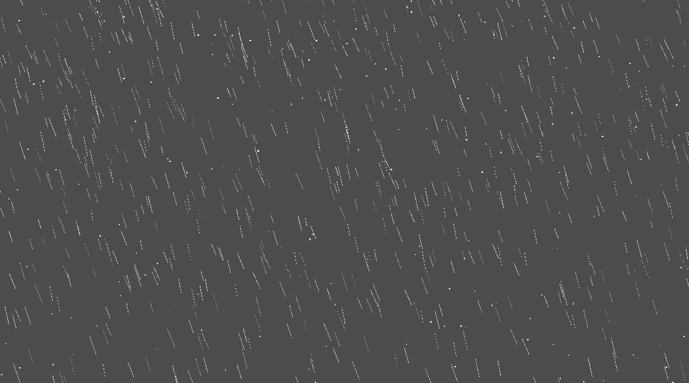
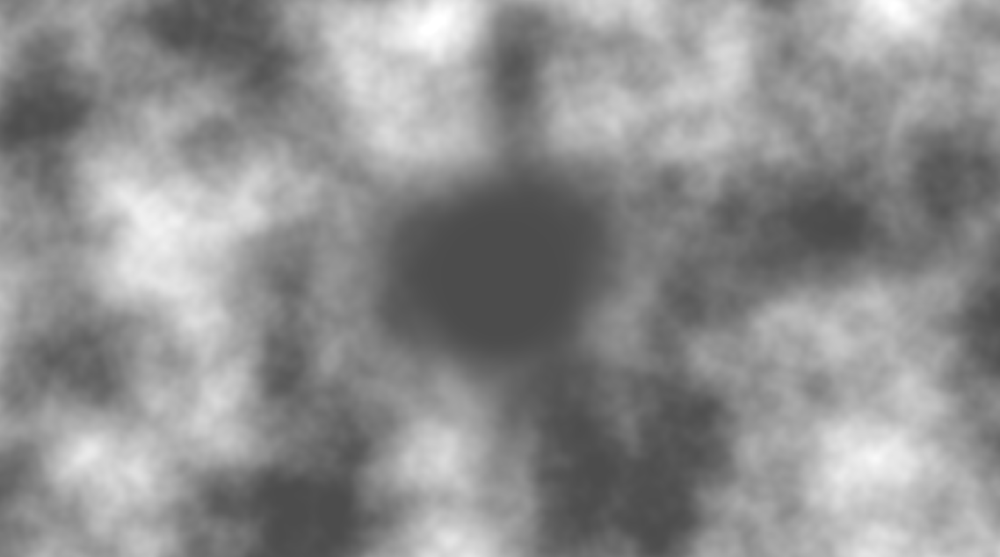
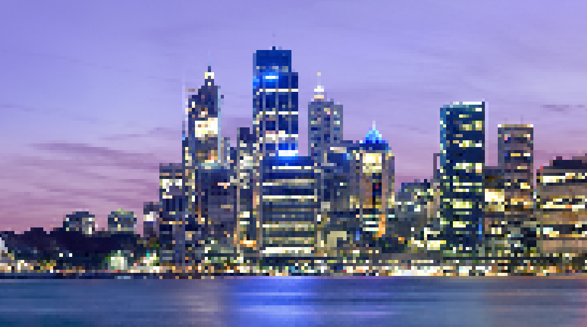
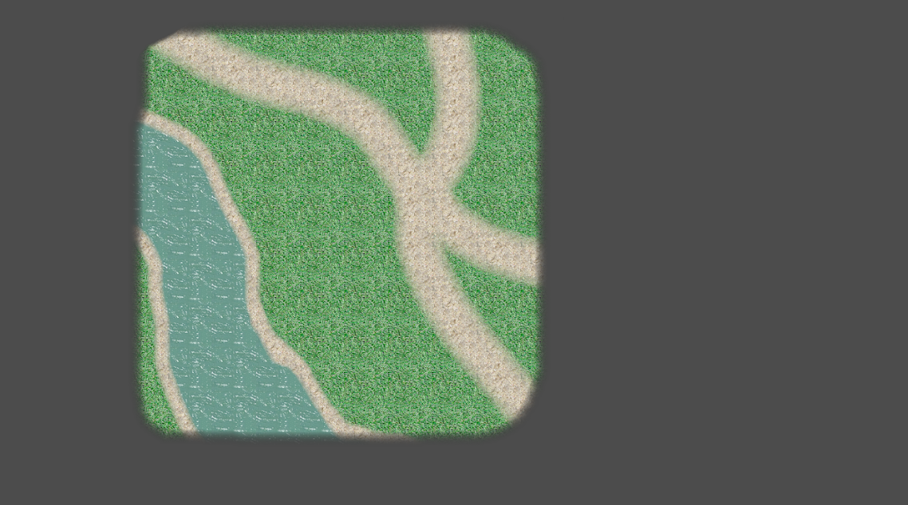
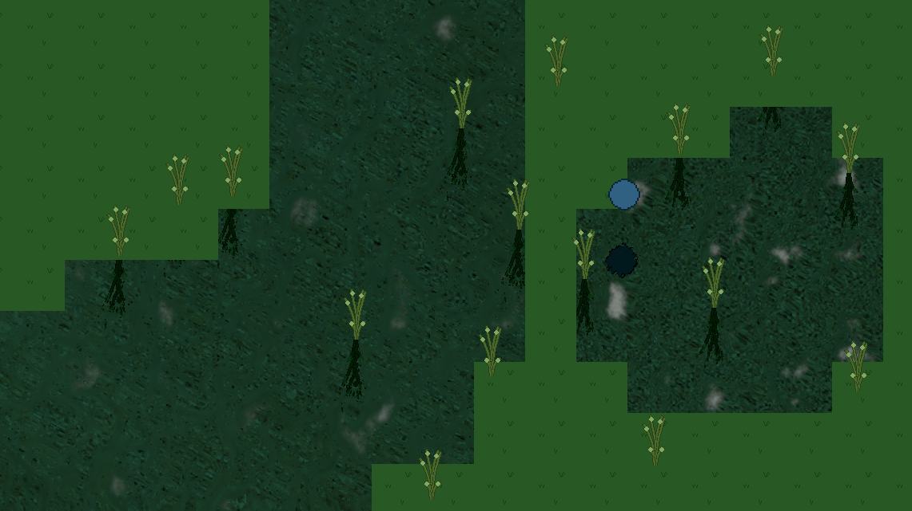
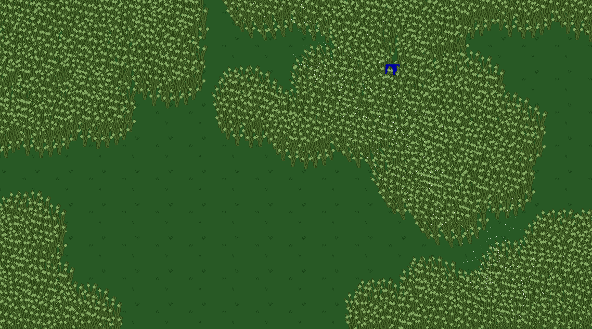

# Godot Visual 2D Effects

## Description
This repository contains a collection of visual effects for Godot. You can clone the repository and open the project directly in Godot to try our all effects in designated demo scenarios. I try to keep all effects as modular and portable as possible. Each effect also cones with its own ReadMe which explains its deployment. The effects are designed specifically for top down 2D games. However, most are also usable in side-scroller visuals.

## Effect List
The following effects are contained in the repository:

- <b>Downfall Effect</b>: a parametrized rain/snow effect over the canvas.

- <b>Fog Effect</b>: a parametrized, dynamic, and animated fog effect over the canvas.

- <b>Pixelation Effect</b>: a shader for pixelation of any sprites.

- <b>Texture Splatting Effect</b>: a shader which allows to translate the colors on a splatmap to textures on a sprite. Useful for terrain generation.

- <b>Water Effect</b>: a parametrized water shader/script system, which allows not only waves and distortions of object beneath the water, but also to mirror sprites on top of the water.

- <b>Wind Effect</b>: a wind controller which allows for wind waves or constant wind. There is also a plant motion controller in here which can listen to the signals of the wind controller and correctly animate the plants.
